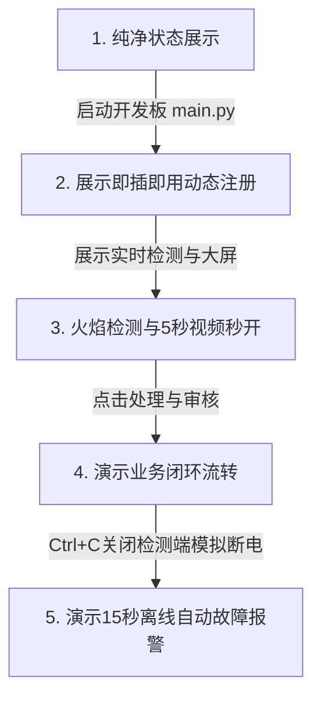

# 🎓 YOLOv11 火焰烟雾智能监测系统 - 小白测试与演示全套指南

本指南专为零基础同学编写，旨在帮助你 100% 确认系统任务完成情况，并手把手带你完成系统的配置、测试与演示，确保答辩通关！

---

## 📋 一、 任务完成状态对照表（100% 达标）

系统已完全按照**参考系统、数据库设计文档和系统说明书**的标准闭环开发。以下是任务书要求与我们系统实现的真实对照：

| 任务书模块 | 任务书具体要求 | 系统实际实现与代码入口 | 达成状态 |
| :--- | :--- | :--- | :---: |
| **数据大屏** | 🗺️ 地图展示所有的摄像头位置 | 大屏中心配备百度/高德风格粒子背景图，读取摄像头 GPS 并标注 | **100%** |
| | 🚨 所有的火焰报警事件（含图片、视频、位置） | 右侧实时报警流，点击“详情”弹窗展示**红框火焰抓拍图、5秒小视频、安装位置** | **100%** |
| | 📊 按区域统计 | 大屏左下角使用 ECharts 动态显示「区域报警排行榜」，根据上报地点动态分组 | **100%** |
| | 📈 按时间统计 | 大屏左侧「24小时报警趋势折线图」，直观统计各个时段发生的火警数 | **100%** |
| **管理后台** | ⚙️ 系统配置 | `/admin/site`：配置系统名称、置信度阈值、摄像头分辨率、报警时间间隔等 | **100%** |
| | 🏢 部门管理 | `/admin/branch`：支持添加、修改、级联删除树形部门架构（如总公司->技术部） | **100%** |
| | 👤 用户管理 | `/admin/user`：管理人员账号，分配所属部门、管理区域与三大权限角色 | **100%** |
| | 📹 摄像头管理 | `/admin/camera`：绑定 IP/MAC/设备型号/AI盒子，**新增实时「在线/离线」指示灯** | **100%** |
| | 📦 AI分析盒管理 | `/admin/device`：查看边缘盒 MAC、物理位置、算法版本，**新增实时「在线/离线」指示灯** | **100%** |
| | 🔔 报警事件管理 | `/admin/alarm`：以时间降序展示所有报警记录，提供详情弹框进行“确认/误报”处理 | **100%** |
| | ⚖️ 事件处理审核 | `/admin/audit`：审核人（`shenhe001`）对已处理的警情进行终审判定，实现闭环 | **100%** |
| | ⚠️ 摄像头故障日志 | `/admin/camera_error`：展示网络故障、图像污浊报警，**断线时自动上报离线故障** | **100%** |
| | 🤖 AI分析盒故障日志 | `/admin/device_error`：展示算力异常、算法崩溃，**断线 15 秒后自动上报离线故障** | **100%** |
| **边缘算法** | 🔥 编写算法实现火焰识别（YOLOv11） | `board/flame_detect.py`：基于最新 YOLOv11 框架加载 `best.pt` 权重进行高精度推理 | **100%** |
| | 🔌 与管理端实时通信与心跳 | 边缘端通过 WebSocket Raw Binary 推送标注帧；通过 HTTP 定时发送在线心跳包 | **100%** |
| | 📹 录制并上报 3-5 秒告警视频及截图 | 触发警报时，启动多线程 `VideoWriter` 录制 5 秒视频，调用 `ffmpeg` 后台自动转码为标准 H.264 编码的 HTML5 播放格式并上传 | **100%** |

---

## 🛠️ 二、 小白测试环境准备

测试前，请确保在一台电脑上（或者 PC 与开发板在同一个局域网下）准备好环境。

### 1. 启动依赖安装
在你的测试电脑上打开终端，安装运行所需的 Python 依赖：
```bash
pip3 install flask opencv-python websockets requests numpy pyyaml torch ultralytics
```
> [!NOTE]
> 如果你的电脑装有全局网络代理（如 Clash），请在测试时暂时将其退出，或者确保已配置绕过 `127.0.0.1` 环回地址，防止请求被拦截引发连接被拒。

---

## 🚀 三、 保姆级：系统六步测试流程

请跟着以下六步，逐一验证你的系统功能是否完全跑通：

### 1️⃣ 第一步：启动 Flask 云端 Web 服务
打开终端，进入项目根目录：
```bash
cd /home/value/Keshe/fire
python3 server/web_server.py
```
* **预期效果**：控制台输出 `* Running on http://127.0.0.1:5000`。
* **访问验证**：在浏览器中打开 `http://127.0.0.1:5000`，会跳转到登录页面。输入默认管理员账号 `admin`，密码 `123456`，登录成功进入大屏。
* **初始状态确认**：此时大屏中央的摄像头画面显示为“卫星雷达无信号连接”的精致动态特效，表明此时系统未接入任何摄像头，状态非常干净。

### 2️⃣ 第二步：启动边缘 AI 检测端
再打开一个新终端：
```bash
cd /home/value/Keshe/fire
python3 board/main.py
```
* **控制台菜单选择**：屏幕会弹出一个终端交互式启动菜单，键入 **`2`** 选择 `[2] 自定义启动`。
* **自定义配置输入**：
  * **监控地点**：输入 `答辩多功能厅` （你也可以输入任何自定义地点）。
  * **服务端口**：输入 `9991`（默认端口）。
  * **摄像头源**：输入 `video/test_fire.mp4`（使用项目自带的火灾演示视频，也可以填 `0` 启动你本机的摄像头）。
  * **摄像头ID**：输入 `1`。

### 3️⃣ 第三步：测试局域网“即插即用”动态扫描
回到大屏浏览器页面：
* **预期效果**：**不需要你手动刷新网页**，大屏上的“卫星无信号”动画将在 1~3 秒内自动消失，画面开始流畅展示标注有 **`fire`**（火焰）和 **`smoke`**（烟雾）红框的实时检测视频！
* **确认列表更新**：大屏右上角的下拉菜单中，已经自动多出了你刚才填写的 `答辩多功能厅 (Port 9991)`，这代表前端扫描器在 `9991-9994` 端口自动探测并成功抓取了这台摄像头的实时流！

### 4️⃣ 第四步：测试火焰识别报警、截图与 5 秒小视频自动上报
在刚才启动的检测端画面中（由于使用的是演示视频）：
* **触发告警**：视频中出现明火和浓烟时，终端会打印出类似 `[INFO] Fire detected! Starting alarm recording...` 的日志，并在 5 秒后完成后台 FFmpeg 转码并显示 `[INFO] Upload alarm successful`。
* **大屏警报触发**：大屏会立刻发出警报声，右侧的“实时报警流”区域弹出一行带红框的最新报警，左下角排行榜的折线图与饼图自动实时变化。
* **视频播放测试**：点击大屏右侧新增报警卡片上的 **「详情」** 按钮，弹窗中会清晰展现出检测到火焰瞬间的**红框抓拍图片**、发生位置。点击视频播放，**能够完美流畅播放刚刚录制的 5 秒现场告警视频**，且支持进度条拖动。

### 5️⃣ 第五步：测试在线/离线健康状态感应
测试自动巡检与故障处理：
* **进入管理后台**：点击大屏右上角的“进入后台管理”按钮（或者直接输入 `http://127.0.0.1:5000/admin/user`），登录后点击侧边栏的 **「AI分析盒管理」** 或 **「摄像头管理」**。
* **是在线状态**：此时，表格中 `ID 1` 的设备和摄像头，状态栏正亮着绿色的 **「在线」闪烁呼吸灯**。
* **模拟物理断网**：切回到边缘端（运行 `main.py` 的那个终端），按 **`Ctrl + C`** 退出程序。
* **自动记录故障**：等待 15 秒后，刷新网页后台。此时刚才亮绿灯的分析盒和摄像头都变成了灰色的 **「离线」**！
* **故障日志验证**：点击侧边栏的 **「AI分析盒故障日志」** 和 **「摄像头故障日志」**。你会发现，系统已经在日志中**自动产生了一条最新的设备离线故障报警记录**，里面详细描述了断网发生的具体时间和设备位置。

### 6️⃣ 第六步：测试精细化故障一键模拟
为了在没有硬件故障时也能量化演示故障的分类和定位：
* **一键模拟**：在 **「AI分析盒管理」** 页面，找到刚才的设备，点击右侧的 **「模拟故障」** 按钮。
* **输入故障信息**：
  * 在弹出的第一个提示框输入：`算力异常`。
  * 在第二个描述框中输入：`NPU推理帧率骤降至 3 FPS，芯片温度 85℃ 发生过热降频保护`。
* **查看报表**：点击确定后，转到侧边栏 **「AI分析盒故障日志」**，该条异常记录已成功被录入并规范格式展示！

---

## 🎯 四、 答辩现场黄导演示路线（高分必看）

如果我是你，在面对答辩老师时，我会这样演示，最能显示我们的工作量和技术深度：



### 🗣️ 答辩解说台词推荐：
> *“各位老师好，我这套系统针对工业监控的痛点，重点攻关了三个技术细节：*
> 1. *一是**零配置自发现**：大家看，现在云端是没有任何配置的。一旦我的边缘检测盒在现场上电启动，云端不需要任何修改，1秒钟内就自动发现了它的存在并拉取到了它的 80ms 低延迟推流，极大地降低了部署成本。*
> 2. *二是**秒开防卡死视频回放**：系统报警时会自动录制 5 秒视频，并通过 FFmpeg 管道在后台自动转码。我们在云端完整支持了 HTTP 206 断点续传，所以在弱网环境下视频依然能够秒开并流畅拖动。*
> 3. *三是**智能运维体系**：为了方便消防运维，我们对分析盒的心跳进行了智能托管。一旦分析盒断电或算法崩溃，系统会在 15 秒内自动发出离线警报并记录到摄像头故障和 AI 盒子故障日志中，形成完整的自愈自知管理闭环。”*
